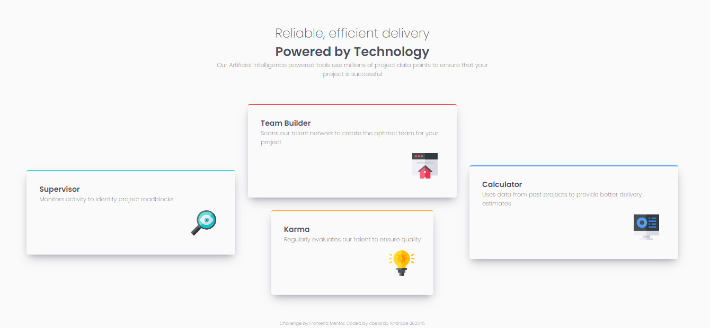

# Frontend Mentor - News homepage solution

This is a solution to the [News homepage challenge on Frontend Mentor](https://www.frontendmentor.io/challenges/four-card-feature-section-weK1eFYK).. Frontend Mentor challenges help you improve your coding skills by building realistic projects. 

## Table of contents

- [Overview](#overview)
  - [The challenge](#the-challenge)
  - [Screenshot](#screenshot)
  - [Links](#links)
- [My process](#my-process)
  - [Built with](#built-with)
  - [What I learned](#what-i-learned)
  - [Continued development](#continued-development)
  - [Useful resources](#useful-resources)
- [Author](#author)
- [Acknowledgments](#acknowledgments)

## Overview

### The challenge

Users should be able to:

- View the optimal layout for the interface depending on their device's screen size
- See hover and focus states for all interactive elements on the page

### Screenshot

### Links

- Solution URL: [Add solution URL here](https://github.com/AbelardoAndrade/four-card-feature-section-master)
- Live Site URL: [Add live site URL here](https://your-live-site-url.com)

## My process

### Built with

- Semantic HTML5 markup
- CSS custom properties
- Flexbox
- CSS Grid

### What I learned

I learned to use responsive layouts and use semantics tags. This is my first job without the help of a mentor or video class.

### Continued development

In my future projects, I will study these concepts and apply again all these tools. I'm very happy with my job.

### Useful resources

- Bootstrap 5 helped me with the cards. 

## Author

- Website - [Abelardo Andrade](https://github.com/AbelardoAndrade)
- Frontend Mentor - [@AbelardoAndrade](https://www.frontendmentor.io/profile/AbelardoAndrade)
- @instagram - [@AbelardoAndradeOficial](https://www.instagram.com/AbelardoAndradeOficial)
All my contacts are on my GitHub Page.

## Acknowledgments

To God, I am grateful for giving me the power and perseverance to continue.
This is a big conquest for me.
